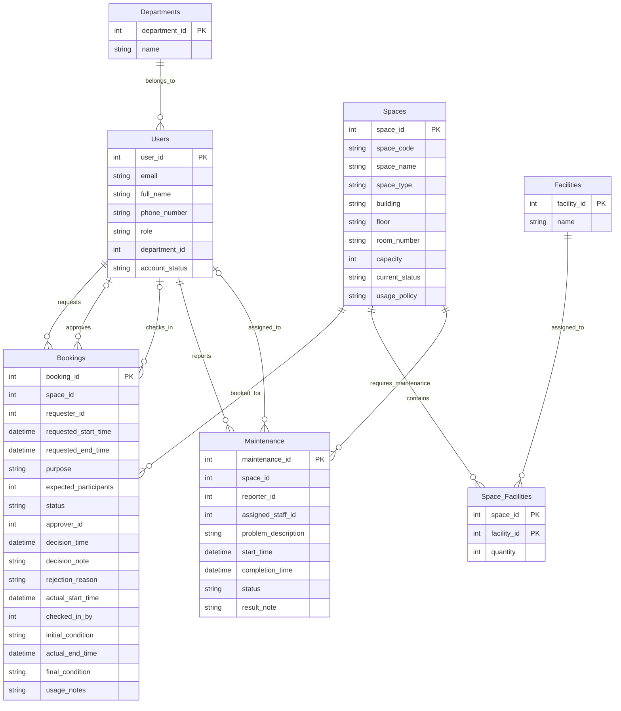
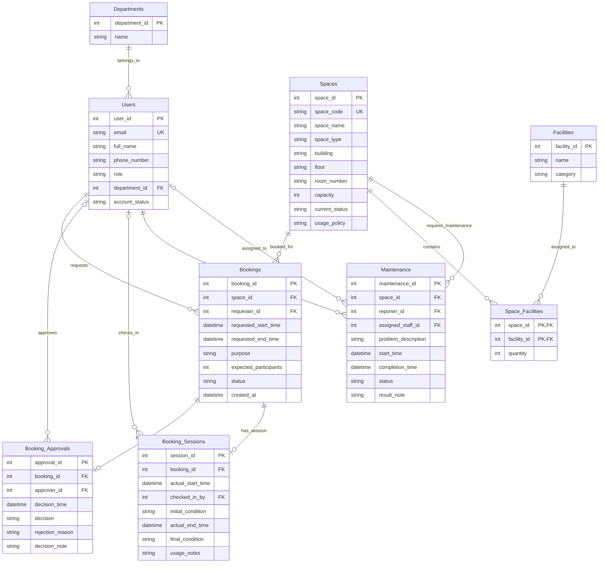

The last ERD

Problems with the last ERD:
- Fat Booking Table, violate Single Responsibility Principle. It contains attributes related to booking request, approval, and session check-in. When Booking status is "Pending", many attributes like `approver_id`, `decision_time`, `decision_note`, `rejection_reason`, `actual_start_time`, `checked_in_by`, `initial_condition`, `actual_end_time`, `final_condition`, and `usage_notes` are null, which causes redundancy. 
- Lack of History Tracking of Status Changes. The Booking table only stores the current status of a booking, but it does not keep track of the history of status changes. This makes it difficult to audit or analyze the booking process over time.
- Rejection Reason and Decision Note are stored in the Booking table, which may not be appropriate. These attributes are only relevant when a booking is rejected or approved, and they may not be applicable to all bookings. Storing them in the Booking table can lead to confusion and make it harder to understand the booking process.

Improvements in the new ERD:
- Split Booking table into three separate tables: Bookings, Booking_Approvals, and Booking_Sessions. This adheres to the Single Responsibility Principle, reducing redundancy and improving clarity. Each table now focuses on a specific aspect of the booking process: 
  - Booking is used for the initial request
  - Booking_Approvals is used for the approval process,
  - Booking_Sessions is used for session check-in.
