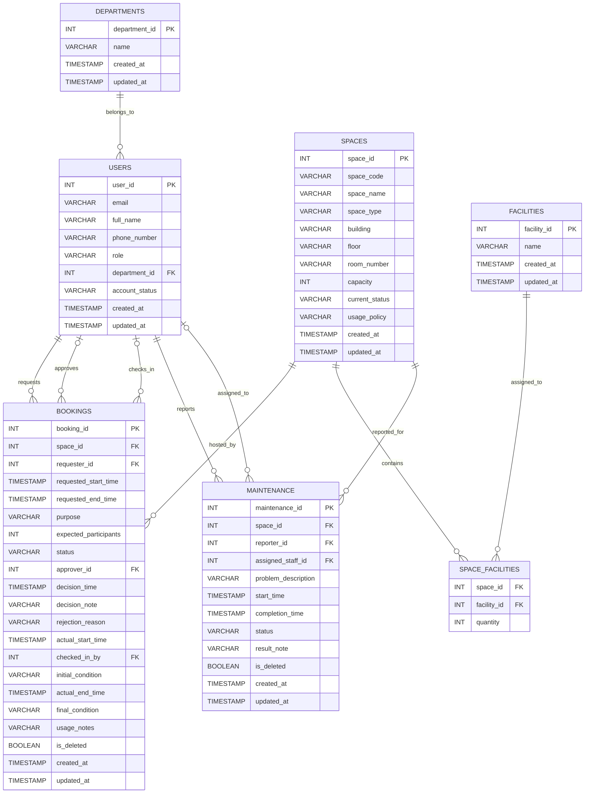

# ERD — Campus Space Management System (G05)

**Source:** `docs/entity-registry.md`
**Group:** G05

## Analysis

The Campus Space Management System centers on 7 entities: `Departments`, `Users`, `Spaces`, `Facilities`, `Space_Facilities`, `Bookings`, and `Maintenance`. `Users` is the hub entity, participating in 5 of 9 relationships — as requester, approver, and check-in staff for `Bookings`, and as reporter and assigned staff for `Maintenance`. The M:N between `Spaces` and `Facilities` is resolved via the `Space_Facilities` junction table.

## Entity-Relationship Diagram

## Relationship summary

| # | Relationship | Notation | Cardinality | Participation |
|---|---|---|---|---|
| R1 | DEPARTMENTS → USERS | `\|\|--o{` | 1:N | Users total |
| R2 | USERS → BOOKINGS (requester) | `\|\|--o{` | 1:N | Bookings total on requester |
| R3 | USERS → BOOKINGS (approver) | `\|o--o{` | 1:N | Bookings partial |
| R4 | USERS → BOOKINGS (checked-in by) | `\|o--o{` | 1:N | Bookings partial |
| R5 | SPACES → BOOKINGS | `\|\|--o{` | 1:N | Bookings total on space |
| R6a | SPACES → SPACE_FACILITIES | `\|\|--o{` | 1:N | both partial (M:N decomposition) |
| R6b | FACILITIES → SPACE_FACILITIES | `\|\|--o{` | 1:N | both partial (M:N decomposition) |
| R7 | SPACES → MAINTENANCE | `\|\|--o{` | 1:N | Maintenance total on space |
| R8 | USERS → MAINTENANCE (reporter) | `\|\|--o{` | 1:N | Maintenance total on reporter |
| R9 | USERS → MAINTENANCE (assigned staff) | `\|o--o{` | 1:N | Maintenance partial |
