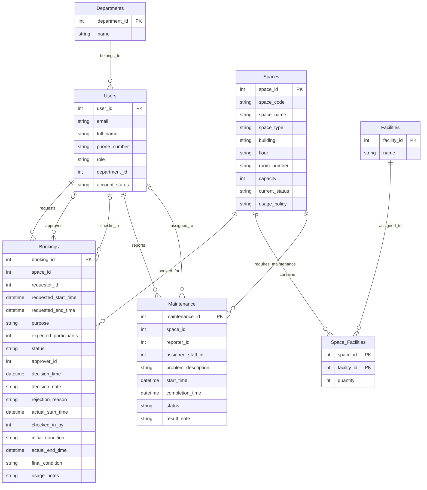

# Conceptual Entity-Relationship Diagram (ERD) — Campus Space Management System

**Group:** G05
**Course:** CS486 — Introduction to Database System
**Date:** 2026-06-17

---

## 1. Description and Core Entities

The Campus Space Management System database centers on **Users**, **Spaces**, and **Bookings**, supported by organizational units (**Departments**) and equipment profiles (**Facilities**). The core relationships track the booking request and approval lifecycle — from submission through check-in and completion — as well as maintenance requests and assignments. Junction table **Space_Facilities** resolves the many-to-many relationship between bookable rooms and equipment types.

---

## 2. Mermaid.js ERD

---

## 3. Relationship Participation Summary

| # | Relationship | Cardinality | Mermaid Notation | Participation Explanation |
|---|---|---|---|---|
| R1 | Departments → Users | 1:N | `Departments \|\|--o{ Users` | Every User must belong to exactly 1 Department (total on Users — `department_id` NOT NULL); a Department may have zero or many Users. |
| R2 | Users → Bookings (requester) | 1:N | `Users \|\|--o{ Bookings` | Every Booking must have exactly 1 requester (total on Bookings — `requester_id` NOT NULL); a User may have zero or many Bookings. |
| R3 | Users → Bookings (approver) | 1:N (partial) | `Users \|o--o{ Bookings` | A Booking may have zero or one Approver (partial — `approver_id` is nullable, set only on approval/rejection decision); a User acting as approver may handle zero or many Bookings. |
| R4 | Users → Bookings (checked-in by) | 1:N (partial) | `Users \|o--o{ Bookings` | A Booking may have zero or one check-in staff member (partial — `checked_in_by` is nullable, set only at check-in); a User may check in zero or many Bookings. |
| R5 | Spaces → Bookings | 1:N | `Spaces \|\|--o{ Bookings` | Every Booking must reference exactly 1 Space (total on Bookings — `space_id` NOT NULL); a Space may have zero or many Bookings. |
| R6 | Spaces ↔ Facilities | M:N | `Spaces \|\|--o{ Space_Facilities` / `Facilities \|\|--o{ Space_Facilities` | A Space may contain zero or many Facility types; a Facility type may be assigned to zero or many Spaces. The junction table Space_Facilities resolves the M:N by holding a composite PK of (space_id, facility_id). |
| R7 | Spaces → Maintenance | 1:N | `Spaces \|\|--o{ Maintenance` | Every Maintenance record must reference exactly 1 Space (total on Maintenance — `space_id` NOT NULL); a Space may have zero or many Maintenance records. |
| R8 | Users → Maintenance (reporter) | 1:N | `Users \|\|--o{ Maintenance` | Every Maintenance record must have exactly 1 reporter (total on Maintenance — `reporter_id` NOT NULL); a User may report zero or many issues. |
| R9 | Users → Maintenance (assigned staff) | 1:N (partial) | `Users \|o--o{ Maintenance` | A Maintenance record may have zero or one assigned staff member (partial — `assigned_staff_id` is nullable, may be set later); a User may be assigned to zero or many Maintenance records. |

---

## 4. Logical Constraints

These constraints are enforced at the application or trigger level and are not expressible in Mermaid ERD syntax:

1. **Approver role constraint** — `Bookings.approver_id` must reference a User with `role IN ('facility_staff', 'facility_manager')`. Students, lecturers, TAs, and department admins may not approve or reject bookings.

2. **Check-in staff role constraint** — `Bookings.checked_in_by` must reference a User with `role IN ('facility_staff', 'facility_manager')`. Only authorized facility personnel may perform check-in.

3. **Assigned maintenance staff constraint** — `Maintenance.assigned_staff_id` must reference a User with `role = 'facility_staff'`. Only facility staff may be assigned to resolve maintenance issues.

4. **Booking non-overlap constraint** — No two Bookings for the same Space may have overlapping time ranges when both are in status `approved`, `checked_in`, or `completed`. Overlap condition: `requested_start_time < existing_end_time AND requested_end_time > existing_start_time`.

5. **Space availability constraint** — A Space with `current_status IN ('under_maintenance', 'temporarily_closed', 'retired')` may not receive new approved Bookings.

6. **Soft deletion** — Bookings and Maintenance records use `is_deleted = 1` for logical deletion, preserving historical records for audit and reporting. Hard deletes are not permitted on these tables.

---

## 5. Design Decisions

- **Incident reporting is not a separate entity** — Incidents are captured within the Maintenance entity via `problem_description` and `result_note`. No distinct attributes (e.g., severity, incident_type) differentiate incidents from maintenance requests in the current requirement. If such attributes are needed in the future, a separate `Incidents` entity should be created and documented in `docs/design-decisions.md`.

- **Building and floor are free-text fields** — `building` and `floor` are `NVARCHAR` free-text columns on `Spaces`, not separate reference tables. This simplifies the schema at the cost of building-based reporting flexibility. See ambiguity Q5 in `outputs/01-business-req-analysis-G05.md`.

- **Rejection reason is a separate column** — `rejection_reason` is stored as a distinct `NVARCHAR(MAX)` column on `Bookings`, separate from `decision_note`. This resolves ambiguity Q1 from the business requirements by keeping rejection-specific text distinguishable from general approval notes.

---

## Pre-Submission Validation Checklist

- [x] All 7 entities from entity-registry are present (Departments, Users, Spaces, Facilities, Space_Facilities, Bookings, Maintenance)
- [x] All business attributes from entity-registry are present for each entity (audit columns omitted — physical-layer concern)
- [x] All 9 relationships from the Relationship Registry are present (R1–R9)
- [x] Cardinality is correct: 1:N for R1–R5, R7–R9; M:N resolved via junction for R6
- [x] Participation constraints (`||` mandatory, `|o` optional) are explicitly stated and justified per Section 3
- [x] Junction table Space_Facilities is rendered as a standalone entity with 1:N relationships to Spaces and Facilities
- [x] Foreign keys are represented by relationship lines — not marked in entity attribute blocks (only `PK` markers)
- [x] Primary keys are marked with `PK`
- [x] No duplicate entity definitions
- [x] Role-based constraints documented in Section 4 (Logical Constraints)
- [x] Entity count matches business requirement (7 entities)
- [x] Incident reporting justified as part of Maintenance (Section 5)

---

*Generated for CS486 Group G05 — Campus Space Management System*
