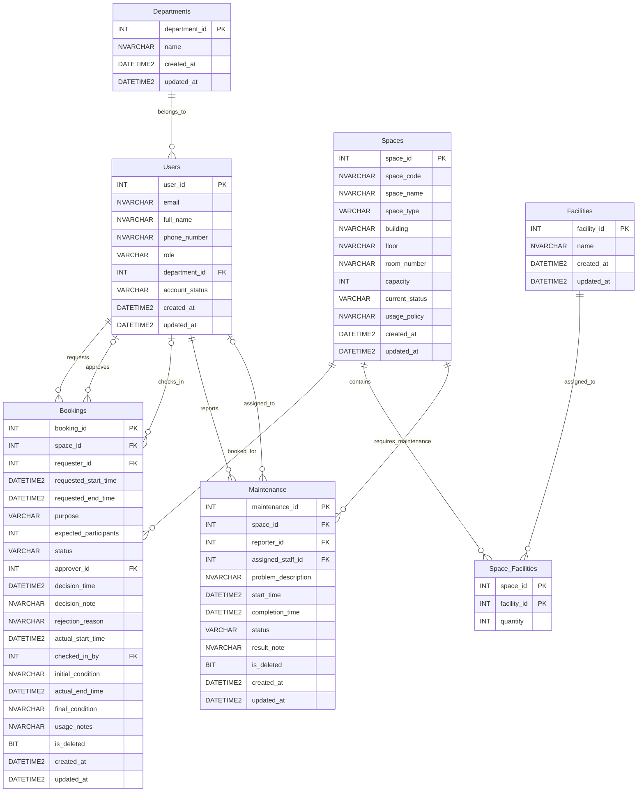

# Conceptual Entity-Relationship Diagram (ERD) — Campus Space Management System

## 1. Description and Core Entities
The Campus Space Management System database centers on **Users**, **Spaces**, and **Bookings**, supported by organizational units (**Departments**) and equipment profiles (**Facilities**). The core relationships track the booking request and approval lifecycle, as well as maintenance requests and assignments. Junction table **Space_Facilities** resolves the many-to-many relationship between bookable rooms and equipment types.

## 2. Mermaid.js ERD

