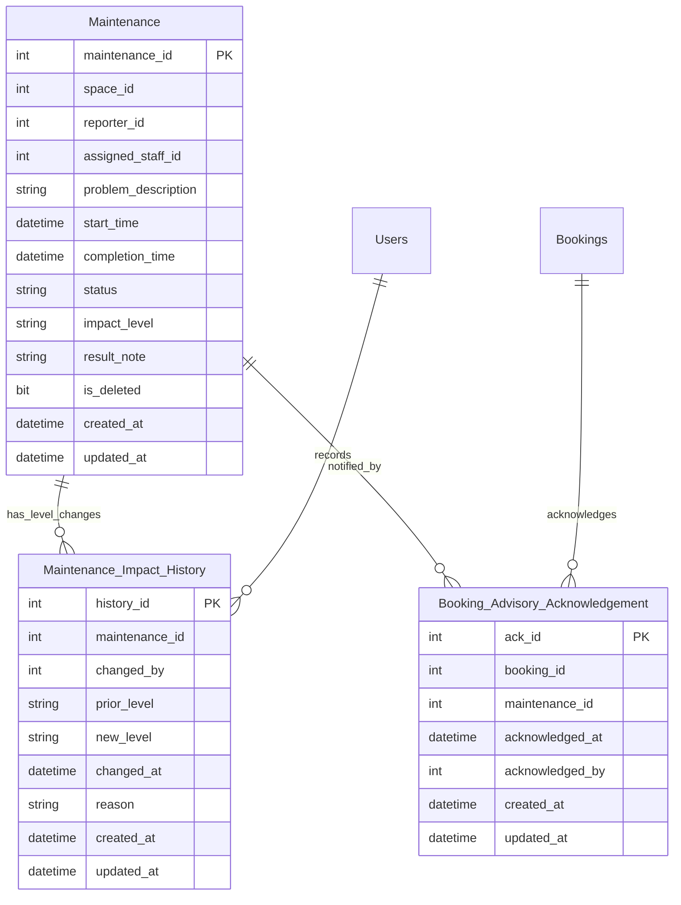
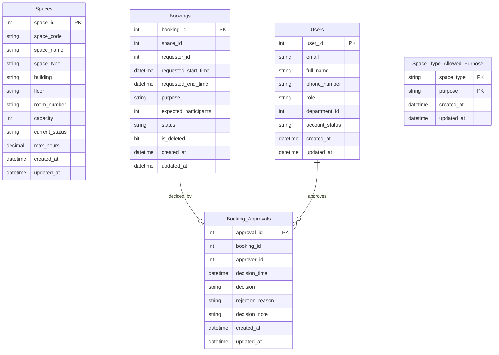
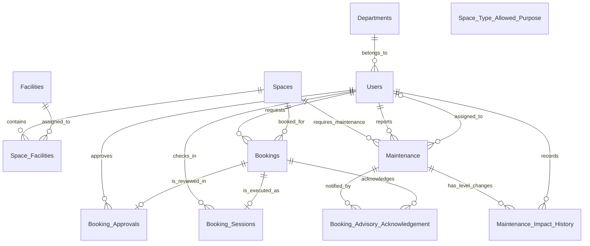

# Updated ERD + Logical Design — Campus Space Management System (Phase 2)

**Group:** G05
**Course:** CS486 — Introduction to Database System
**Phase:** 2 · **Task:** 09
**Date:** 2026-08-04

---

## 1. Overview

This document updates the Phase 1 ERD and logical schema for the Phase 2 extension on
top of the frozen baseline (`docs/design-decisions.md` — schema unfrozen for the
affected tables `maintenance` and `bookings`, Option B).

**This run covers all three Phase 2 change areas** (C1–C3 from Task 08):

| Area | Phase 1 baseline | Phase 2 design |
|---|---|---|
| **1 — Maintenance impact levels** | every active maintenance blocks booking | `maintenance.impact_level` (`advisory` \| `out-of-service`); only `out-of-service` blocks an overlapping booking; escalation/downgrade logged; advisory acknowledgement recorded |
| **2 — Concurrent/instant booking** | booking approval is staff-only, recorded in `booking_approvals` | eligible space types may be auto-approved at submission; the origin (instant vs staff) is **derived** from the reserved system approver (`approver_id = -1`); the usage policy is **data-driven** — `(space_type, purpose) ∈ space_type_allowed_purpose` ∧ duration ≤ `spaces.max_hours` (NULL = unlimited), on top of the prior active-account / capacity / overlap / out-of-service checks; new schema `space_type_allowed_purpose` + `spaces.max_hours`; `spaces.usage_policy` free-text dropped |
| **3 — Analytical reporting** | staff-view reports (BR14) | four new reports; all answerable as queries over the existing + Area-1 schema — **no schema change required** |

**Revision 2.5 (2026-08-07):** Area 2 is extended so the usage-policy test (U1) is
**data-driven** — instant eligibility is defined by the `space_type_allowed_purpose`
junction (seeded for the four previously approved types) plus a per-space duration cap
`spaces.max_hours`, replacing the hardcoded eligible-set/test description from v2.0–2.4
and the (never-enforced) `spaces.usage_policy` text. The derived origin
(`approver_id = -1`) design is **unchanged**.

Task 09 designs **ERD and logical schema only**. The migration scripts (Task 10), the
concurrency controls/mechanisms (Tasks 11–13), index tuning (Task 15), and the query
implementations (Task 16) are out of scope here.

---

## 2. Section A — Area 1: Maintenance impact levels & advisory acknowledgement

### A.1 Updated ERD (Area 1 only)

> Attribute-level consistency: the excerpts above list **every column of the logical
> tables in §A.2**, including the audit columns (`created_at`, `updated_at`) and the
> soft-delete flag (`is_deleted`), so the ERD excerpt matches the table definitions
> column-for-column.

Relationship notes (new / changed only):

| Relationship | Cardinality | Participation | Meaning |
|---|---|---|---|
| Maintenance → Maintenance_Impact_History | 1:N | total on history | every level change belongs to exactly one maintenance record |
| Users → Maintenance_Impact_History | 1:N | total on history | each change is recorded by exactly one user (`changed_by`) |
| Maintenance → Booking_Advisory_Acknowledgement | 1:N | total on ack | each acknowledgement refers to exactly one maintenance record |
| Bookings → Booking_Advisory_Acknowledgement | 1:N | total on ack | each acknowledgement is attached to exactly one booking |

> The acknowledgement table resolves the many-to-many "a booking may be informed of
> several advisories; one advisory may affect several bookings" into an associative
> table with one row per (booking, advisory) pair.

### A.2 Logical tables

#### A.2.1 `maintenance` (changed — add `impact_level`)

| Column | Type | Nullable | PK / UQ | FK Reference | Default | Notes |
|--------|------|----------|---------|-------------|---------|-------|
| … *(all Phase 1 columns unchanged)* | | | | | | |
| **impact_level** | VARCHAR(50) | NO | — | — | `'out-of-service'` | NEW (NR1). CHECK IN ('advisory','out-of-service'). Default preserves Phase 1 blocking for legacy rows on migration. |

**Constraint / behavior changes (schema-affecting only):**
- **BR2/BR4 (re-filtered):** only `out-of-service` maintenance blocks an overlapping
  booking. The re-scoping touches the enforcement triggers (`trg_bookings_check_maintenance`,
  `trg_booking_approvals_check_space`) and is implemented in Task 10/11 — the logical
  schema change here is only the `impact_level` column itself.

#### A.2.2 `maintenance_impact_history` (new — NR3)

Records every escalation (advisory → out-of-service) or downgrade while the maintenance
is still open.

| Column | Type | Nullable | PK / UQ | FK Reference | Default | Notes |
|--------|------|----------|---------|-------------|---------|-------|
| history_id | INT | NO | PK | — | IDENTITY(1,1) | |
| maintenance_id | INT | NO | — | maintenance(maintenance_id) | — | ON DELETE CASCADE |
| changed_by | INT | NO | — | users(user_id) | — | user who changed the level |
| prior_level | VARCHAR(50) | NO | — | — | — | CHECK IN ('advisory','out-of-service') |
| new_level | VARCHAR(50) | NO | — | — | — | CHECK IN ('advisory','out-of-service'); must differ from prior_level |
| changed_at | DATETIME2 | NO | — | — | DEFAULT GETDATE() | |
| reason | NVARCHAR(MAX) | YES | — | — | — | optional escalation/downgrade note |
| created_at | DATETIME2 | NO | — | — | DEFAULT GETDATE() | BR12 |
| updated_at | DATETIME2 | NO | — | — | DEFAULT GETDATE() | BR12 |

**Enforcement:** a trigger on `maintenance UPDATE` inserts a history row whenever
`impact_level` changes and the record is still active (status `open`/`in_progress`)
(trigger behavior — Task 10). `changed_at` timestamps the event, so the NR4 "affected
bookings at escalation time" report can be answered exactly.

#### A.2.3 `booking_advisory_acknowledgement` (new — NR2)

Records that the requester was notified of (and acknowledged) the active advisories on
a space at booking time.

| Column | Type | Nullable | PK / UQ | FK Reference | Default | Notes |
|--------|------|----------|---------|-------------|---------|-------|
| ack_id | INT | NO | PK | — | IDENTITY(1,1) | |
| booking_id | INT | NO | UQ | bookings(booking_id) | — | Part of composite UQ (booking_id, maintenance_id) — see note below |
| maintenance_id | INT | NO | UQ | maintenance(maintenance_id) | — | Part of composite UQ (booking_id, maintenance_id) — the advisory the requester was informed about |
| acknowledged_at | DATETIME2 | NO | — | — | DEFAULT GETDATE() | when the requester confirmed |
| acknowledged_by | INT | NO | — | users(user_id) | — | normally the requester; FK → users |
| created_at | DATETIME2 | NO | — | — | DEFAULT GETDATE() | BR12 |
| updated_at | DATETIME2 | NO | — | — | DEFAULT GETDATE() | BR12 |

**Composite unique key:** `UQ (booking_id, maintenance_id)` is **one** constraint over
both columns, not two independent unique columns. A booking may be affected by several
advisories (one row per advisory), and one advisory may affect several bookings (one row
per booking) — so **neither column is unique on its own; only the pair is**. The
constraint enforces **at most one acknowledgement per (booking, advisory) pair**: the
same booking cannot acknowledge the same advisory twice.

**Enforcement:** at booking INSERT/UPDATE, if any active `advisory` maintenance overlaps
the requested period, the booking is allowed and one acknowledgement row must be
inserted per overlapping advisory. A trigger enforces the correspondence (the ack rows
must reference advisories that overlap the booking's time range) (trigger behavior — Task 10).

**Note (NR4):** no `escalation_notification` table is designed. The "approved bookings
affected when an advisory escalates to out-of-service" report is derived by joining
`booking_advisory_acknowledgement` ↔ `maintenance` where `impact_level` transitioned to
`out-of-service` (report #4, Area 3).

### A.3 `spaces.current_status` handling (U5)

**Design decision (recorded in `docs/design-decisions.md`):** `spaces` schema is
**unchanged** — no new columns, no split status flags. `current_status` becomes a
**display/filter hint** and is **recomputed by a trigger on `maintenance`
INSERT / UPDATE / resolve**, using the combined-state priority rule:

| Priority | Value | Condition |
|---|---|---|
| 1 | `retired` | manual, permanent (never auto-overridden) |
| 2 | `temporarily_closed` | manual override |
| 3 | `under_maintenance` | iff an active `out-of-service` maintenance period covers *now* |
| 4 | `in_use` | iff a live `booking_sessions` row exists (checked in) |
| 5 | `available` | fallback (bookable, not occupied) |

- `advisory` maintenance **never** sets `under_maintenance`; advisory-only space → `available`.
- The recompute must respect `booking_sessions` occupancy (`in_use`) and the manual
  `retired`/`temporarily_closed` overrides.
- The existing `trg_maintenance_completion_space_status` completion logic is folded into
  the new recompute trigger, keeping the `NOT EXISTS` multi-ticket guard (a space stays
  `under_maintenance` while any active out-of-service ticket remains).
- **Correctness never depends on the flag** — booking/approval overlap checks read
  `maintenance` directly (A.2.1). The room-finder and report #4 must also derive from
  `maintenance`/`bookings` overlap in future time interval, not from `current_status` alone.

---

## 3. Section B — Area 2: Concurrent/instant booking & approval (schema only)

### B.1 Updated ERD (Area 2 only)

> Attribute-level consistency: the excerpts above list every column of the logical
> tables in §B.2, including audit columns (`created_at`, `updated_at`) and the
> soft-delete flag (`is_deleted`), matching the table definitions column-for-column.
> Revision 2.5: `Spaces` now shows `max_hours` (new) and no `usage_policy` (dropped).

> `Space_Type_Allowed_Purpose` is a reference table keyed on the `space_type`
> **value** — it carries **no FK** to `spaces` (soft reference by domain pair; see
> §B.2.4). It therefore appears in the ERD excerpt **without** a relationship line:
> `spaces.space_type` and its domain are already covered by the existing CHECK.

> The instant/staff pathway is **derived, not stored**: an approval is `instant` iff
> `approver_id = -1` (the reserved system user), otherwise `staff`. No new attribute,
> entity, or relationship is needed — a stored origin column was rejected to keep
> `booking_approvals` 3NF/BCNF (storing it would add a non-key FD
> `approver_id → origin` and violate 3NF; see §5). The instant approver is a
> **reserved system user row** in `Users` (user_id = -1), so the approver FK
> (R3, BR15) is satisfied unchanged.

### B.2 Logical tables

#### B.2.1 `booking_approvals` (no column change — origin derived)

**No schema change.** The instant/staff origin is **not stored** as a column. It is
derived from the reserved system approver:

- A **stored origin column** was **rejected**: it would introduce the functional
  dependency `approver_id → origin` (instant ⟺ approver_id = -1). Because
  `approver_id` is not a superkey and `origin` is not prime, that FD would
  break 3NF (see §5).
- **Derived instead:** `CASE WHEN approver_id = -1 THEN 'instant' ELSE 'staff' END` in
  queries and reports (NR5). All existing `booking_approvals` columns are unchanged.

**Constraint / behavior notes:**
- `approver_id` stays **NOT NULL**; BR6 (`trg_booking_approvals_decision`) and BR15
  (`trg_booking_approvals_check_role`) remain satisfied because instant approvals are
  recorded against the reserved system user (role `facility_manager`).
- The auto-approval **test** (eligibility + checks 1–6, §B.2.5) is business logic applied
  at submission: hard checks (2, 3, 5, 6) reuse the existing BR1/BR3/BR4 enforcement
  objects and the account-status gate; soft checks (1, 4) read the new
  `space_type_allowed_purpose` junction (§B.2.4) and `spaces.max_hours` (§B.2.3). A soft
  failure creates the booking as `pending` for staff rather than rejecting it. See
  §7 (U1) and §8 (assumptions).

#### B.2.2 `users` (data change only — reserved system user)

**No column change.** The instant-approval path requires an approver identity that is
not a real staff member, so a **reserved seed row** is introduced (implemented in the
Task 10 migration via `SET IDENTITY_INSERT`):

| Attribute | Value | Note |
|---|---|---|
| user_id | **-1** | reserved, outside the IDENTITY range |
| email | `system@campus.edu` | unique business key (A1) |
| full_name | `System Booking Service` | display name |
| phone_number | NULL | optional |
| role | `facility_manager` | satisfies BR15 |
| department_id | (a seeded department) | FK satisfied |
| account_status | `active` | |

This row is documented in `docs/schema-registry.md` as a special record; it must be
excluded from any "real user" reports. The instant approval flow inserts
`booking_approvals(approver_id = -1, decision = 'approved')`; the pathway is derived
as `CASE WHEN approver_id = -1 THEN 'instant' ELSE 'staff' END` (§B.2.1).

#### B.2.3 `spaces` (changed — add `max_hours`, drop `usage_policy`)

| Column | Type | Nullable | PK / UQ | FK Reference | Default | Notes |
|--------|------|----------|---------|-------------|---------|-------|
| … *(all Phase 1 columns unchanged, except as below)* | | | | | | |
| **max_hours** | DECIMAL(5,2) | YES | — | — | `NULL` | NEW (v2.5). Max single-booking duration (hours) for instant eligibility on this space; `CHECK (max_hours > 0)`; `NULL` = no limit |
| **usage_policy** | NVARCHAR(MAX) | — | — | — | — | **REMOVED** — Phase-1 free-text (Q2) was never enforced and its name collided with the data-driven usage-policy test (§B.2.5). Dropped in the Task 10 migration; Phase-1 baseline (05/06) retains it as historical |

**Constraint / behavior notes:**
- `max_hours` is consulted **only** by the instant-eligibility test (soft gate 4,
  §B.2.5); staff approval is duration-agnostic. `NULL` skips the gate.
- The `current_status` recompute design (Area 1, §A.3) is unaffected by this column.

#### B.2.4 `space_type_allowed_purpose` (new — data-driven instant usage policy)

Reference table listing, for each space type, the booking **purposes** permitted for
instant (auto) approval. One row per allowed `(space_type, purpose)` pair.

| Column | Type | Nullable | PK / UQ | FK Reference | Default | Notes |
|--------|------|----------|---------|-------------|---------|-------|
| space_type | VARCHAR(50) | NO | PK | — | — | Part of composite PK; CHECK mirrors `spaces.space_type` (6 types) |
| purpose | VARCHAR(50) | NO | PK | — | — | Part of composite PK; CHECK mirrors `bookings.purpose` (7 values) |
| created_at | DATETIME2 | NO | — | — | DEFAULT GETDATE() | BR12 |
| updated_at | DATETIME2 | NO | — | — | DEFAULT GETDATE() | BR12 |

**Composite PK** `(space_type, purpose)` — a full candidate key; no multi-valued
attribute, no subset determines any non-key column (§5).

**Soft reference (no FK):** `spaces.space_type` is an inline `VARCHAR(50)` + CHECK
(Phase 1), not a lookup FK. This table mirrors the same domain through its own CHECK
constraint. No `space_types` dimension table is introduced — out of scope (consistent
with keeping `space_type` an enumerated string in this phase).

**Instant eligibility is data-defined:** a space type is instant-eligible **iff** rows
exist for it. Reference data (seeded by the Task 10 migration) covers exactly the four
previously approved types, preserving the v2.0–2.4 eligible set:

| space_type | allowed purposes |
|---|---|
| classroom | lecture, examination, seminar, workshop, student_activity |
| computer_lab | lecture, examination, seminar, workshop |
| project_lab | workshop, seminar, meeting, student_activity |
| meeting_room | meeting, seminar, administrative_event, workshop, student_activity |

**Enforcement:** at instant submission, resolve the booking's `space_id → space_type`
(JOIN `spaces`), then verify `(space_type, purpose)` membership (procedure logic —
Task 11/12). Staff approval never consults this table; no trigger enforces it at the
DB level.

#### B.2.5 Instant-approval test — usage policy (U1 revision)

The instant (auto) approval clause is the conjunction of:

| # | Check | Source | Kind |
|---|-------|--------|------|
| 1 | `(space_type, purpose) ∈ space_type_allowed_purpose` (space resolved via JOIN) | §B.2.4 | **soft** |
| 2 | requester `users.account_status = 'active'` | A09-3 | hard |
| 3 | `expected_participants ≤ spaces.capacity` | BR3 | hard |
| 4 | `requested_end_time − requested_start_time ≤ max_hours × 60 min` **OR** `max_hours IS NULL` | §B.2.3 | **soft** |
| 5 | no overlapping confirmed booking (`approved`/`checked_in`/`completed`, `is_deleted = 0`) | BR1 | hard |
| 6 | no overlapping active `out-of-service` maintenance | BR4 | hard |

(NR2 still applies on approval: one acknowledgement row per overlapping active advisory.)

**Soft vs hard disposition (v2.5):** failing a **soft** gate (1 or 4) does **not**
reject the booking — it is created `pending` and routed to the staff-approval workflow;
the instant-submit procedure reports `@instant_accepted = 0` (contract designed in Task
11, implemented in Task 12). Failing a **hard** gate keeps Phase-1 trigger rejection
semantics (the booking cannot exist / cannot be approved).

### B.3 No-schema-change statement (concurrency enforcement)

The Phase 2 requirement that **two approved bookings can never overlap on the same
space across both pathways, even under concurrent operations** (NR6) is enforced
around the existing no-overlap objects (`uq_bookings_active_overlap` +
`trg_bookings_prevent_overlap`, BR1). That invariant is unchanged by this task;
**making it concurrency-safe is a Task 11 concern** and introduces **no additional
ERD/logical schema** here. The instant-vs-staff origin is captured by B.2.1.

---

## 4. Section C — Area 3: Analytical reporting needs

### C.1 No-schema-change statement

The four Phase 2 reports are **fully answerable as queries** over the existing Phase 1
schema plus the Area-1 additions. No support entity or table is required:

| Report | Data source (existing / designed) | Schema change? |
|---|---|---|
| #1 Total approved booking hours per space per semester | `bookings` (approved/checked_in/completed) + `spaces` | No — derived query |
| #2 Approved bookings by weekday & hour per semester | `bookings` | No — derived query |
| #3 Room finder (capacity + facility list within a period) | `spaces` + `space_facilities` + `facilities` + overlap with `bookings`/`maintenance` | No — derived query |
| #4 Approved bookings affected on escalation to out-of-service | `booking_advisory_acknowledgement` ↔ `maintenance` (Area 1) + `bookings` | No — derived query |

> The room-finder and report #4 must derive availability from `bookings`/`maintenance`
> time-overlap, **not** from `spaces.current_status` (Area 1, §A.3). Supporting indexes
> for these queries are the Task 15 index-tuning pass, not a Task 09 schema decision.

---

## 5. 3NF Re-Check

| Relation | 1NF | 2NF | 3NF | Evidence |
|---|---|---|---|---|
| `maintenance` | ✅ atomic, no repeating groups | ✅ single-column PK | ✅ no transitive dependency | `impact_level` is a direct property of `maintenance_id`; no non-key column depends on another non-key column |
| `maintenance_impact_history` | ✅ atomic | ✅ single-column PK `history_id` | ✅ no transitive dependency | `maintenance_id`, `changed_by`, `prior_level`, `new_level`, `changed_at`, `reason`, `created_at`, `updated_at` all depend only on `history_id` |
| `booking_advisory_acknowledgement` | ✅ atomic | ✅ single-column PK `ack_id` | ✅ no transitive dependency | `booking_id`, `maintenance_id`, `acknowledged_at`, `acknowledged_by`, `created_at`, `updated_at` depend only on `ack_id`; the composite UQ (booking_id, maintenance_id) is a **full** alternate key — neither proper subset (`booking_id` alone, `maintenance_id` alone) determines any other column, so no partial dependency on any candidate key exists |
| `booking_approvals` | ✅ atomic | ✅ single-column PK `approval_id` | ✅ no transitive dependency | every column depends only on the candidate keys `approval_id` and `booking_id`; no non-key attribute depends on another non-key attribute (no transitive dependency); the instant/staff origin is **derived from `approver_id = -1`**, not stored, so no non-key FD (e.g. `approver_id → origin`) exists |
| `users` | ✅ atomic | ✅ single-column PK `user_id` | ✅ no transitive dependency | unchanged from Phase 1; the reserved system row does not alter the relation's FDs |
| `spaces` | ✅ atomic | ✅ single-column PK `space_id` | ✅ no transitive dependency | `max_hours` is a direct property of `space_id`; `usage_policy` removed; no non-key column depends on another non-key column |
| `space_type_allowed_purpose` | ✅ atomic | ✅ composite PK `(space_type, purpose)` — **full** key | ✅ no transitive dependency | non-key columns (`created_at`, `updated_at`) depend only on the **full** pair; neither proper subset (`space_type` alone, `purpose` alone) determines any non-key attribute, so no partial dependency exists |

All affected relations satisfy at least 3NF. No functional dependencies beyond
candidate-key determinants → non-key attributes were identified; no multi-valued
attributes; no partial dependencies on any candidate key. Composite-key tables:
`booking_advisory_acknowledgement` carries a surrogate PK (`ack_id`) plus a composite
**unique** key `(booking_id, maintenance_id)` (full pair determines every attribute);
`space_type_allowed_purpose` uses the composite pair `(space_type, purpose)` as its PK
(also a full candidate key, no proper-subset dependency).
`maintenance_impact_history` keeps a single-column surrogate PK.

---

## 6. Deviations from Phase 1 — business rules & related elements

### 6.1 Changed Phase 1 business rules (Phase 2 impact)

| BR | Phase 1 meaning | Phase 2 meaning | Schema impact (this task) | Enforcement change |
|---|---|---|---|---|
| **BR2** | Unavailable spaces cannot be approved (read `spaces.current_status`) | Availability is decided by `out-of-service` maintenance overlap; `current_status` is only a hint | none (spaces unchanged) | `trg_booking_approvals_check_space` re-sourced — Task 10/11 |
| **BR4** | Any unresolved maintenance blocks booking | Only `impact_level='out-of-service'` blocks; advisory overlaps allowed but require acknowledgement | `maintenance.impact_level` (A.2.1) + ack table (A.2.3) | `trg_bookings_check_maintenance` re-filtered — Task 10 |
| **BR19** | Maintenance completion restores space to `available` | Completion feeds the impact-aware recompute; advisory completion never touched `under_maintenance` | none | recompute trigger (A.3) — Task 10 |
| **BR1** | No overlapping approved bookings | Same invariant, now also enforced for auto-approved (instant) bookings | the origin is derived from `approver_id = -1` (B.2.1) | concurrency-safe enforcement — Task 11 |
| **BR14** | Staff view reports | New reporting set (4 reports) | none | query + indexes — Tasks 15/16 |
| **BR6/BR7/BR15** | Approver metadata / role rules | Instant path satisfies them via the reserved system user | reserved `users` row (B.2.2) | none |

### 6.2 ERD / logical schema deviations

| # | Element (Phase 1) | Phase 2 design | Deviation | Justification |
|---|---|---|---|---|
| D1 | `maintenance` had no impact concept | `impact_level VARCHAR(50) NOT NULL DEFAULT 'out-of-service'` | Added column | NR1 — impact levels; default preserves Phase 1 blocking semantics for legacy rows |
| D2 | Escalation/downgrade not modeled | new `maintenance_impact_history` | Added table | NR3 — level changes while open must be tracked; also anchors NR4 escalation-time query |
| D3 | Advisory awareness not modeled | new `booking_advisory_acknowledgement` | Added table | NR2 — must record that the requester was informed of active advisories |
| D4 | `spaces.current_status` a stale hint, set only on completion | recomputed on maintenance INSERT/UPDATE/resolve via priority rule | Behavior change | U5 / `docs/design-decisions.md` — flag must stay consistent with maintenance state; advisory must not set `under_maintenance` |
| D5 | Escalation notification not addressed | no `escalation_notification` table | Decided out of scope | NR4 is report #4 (Area 3), derivable from acknowledgement + maintenance overlap |
| D6 | Approval origin not recorded | derived `approver_id = -1` ⇒ `'instant'`, else `'staff'` (no stored column) | No column added — derived attribute | NR5 — distinguishes auto-approval from staff approval; a stored origin column was rejected because `approver_id → origin` (non-key → non-prime) would break 3NF (§5) |
| D7 | No approver for auto-approval | reserved system user `user_id = -1` (`role='facility_manager'`) | Added seed row (data) | keeps `approver_id NOT NULL` and BR6/BR15 intact |
| D8 | Reporting needs (C3) | no support table added | No schema change | reports are derived queries (§4) |
| D9 | `spaces.usage_policy` free-text (Q2) | column **removed** | Dropped column | never enforced (no consumer); name collides with the data-driven usage-policy test; the 2026-06-15 free-text decision is superseded (`docs/design-decisions.md`) |
| D10 | per-space duration cap not modeled | `spaces.max_hours DECIMAL(5,2) NULL` (`CHECK (max_hours > 0)`, NULL = unlimited) | Added column | instant soft gate (check 4); one UPDATE changes a room's cap without code changes |
| D11 | usage-policy test hardcoded (U1: eligible set + checks 1–5) | `space_type_allowed_purpose` junction | Added table | data-defined instant eligibility — one row per allowed `(space_type, purpose)` pair; seeded for the four approved types (§B.2.4) |
| D12 | instant test checks 1–5 (no purpose / no cap) | checks 1–6: purpose membership + duration cap | Test revision | the NR5 usage-policy test must cover purpose and duration; soft-gate failures route to `pending` instead of rejecting (§B.2.5) |

---

## 7. Resolved Ambiguities

| # | Question | Decision | Designed in |
|---|---|---|---|
| U1 | Which space types are eligible for instant booking; what is the usage-policy test? | Eligible set is **data-defined** by `space_type_allowed_purpose` (seeded for `{classroom, computer_lab, project_lab, meeting_room}`); usage-policy test = checks 1–6: `(space_type, purpose) ∈` junction (soft) ∧ requester `account_status='active'` ∧ participants ≤ capacity (BR3) ∧ duration ≤ `max_hours` (NULL = unlimited) (soft) ∧ no overlap (BR1) ∧ no out-of-service overlap (BR4). Soft-gate failures create a `pending` booking; hard-gate failures reject. | §B.2.3–B.2.5, §8 |
| U2 | How is the advisory acknowledgement captured/stored? | New child table `booking_advisory_acknowledgement`, one row per (booking, advisory), with `acknowledged_at` / `acknowledged_by` | §A.2.3 |
| U5 | Should `out-of-service` maintenance flip `spaces.current_status`, or is the status derived? | `spaces` unchanged; `current_status` is a display hint recomputed on maintenance INSERT/UPDATE/resolve via the priority rule; correctness comes from `maintenance` overlap | §A.3 |

Carried forward (not in Task 09 scope): **U3** (escalation → pending vs only approved — Task 11),
**U4** (semester reporting window — Task 16).

---

## 8. Assumptions / Unresolved Ambiguities

### Assumptions

| # | Assumption | Rationale |
|---|---|---|
| A09-1 | `impact_level` default `'out-of-service'` on migration so legacy maintenance rows keep Phase 1 blocking behavior | Without a default, migrated rows would become advisory and silently stop blocking |
| A09-2 | Advisory acknowledgement is recorded at booking time (insert) and keyed to the specific advisory records | NR2 says "must record that the requester was informed"; per-advisory rows make report #4 derivable |
| A09-3 | The instant-booking test includes the **requester `account_status = 'active'`** gate (check 2) | Account lifecycle attribute exists in Phase 1; an auto-approval must not go to a suspended/inactive account |
| A09-4 | The instant approver is the reserved system user `user_id = -1` (role `facility_manager`) | Keeps `approver_id NOT NULL` and satisfies BR6/BR15 without real-staff involvement |
| A09-5 | Instant auto-approval is a *submission-time* decision; the concurrency-safe enforcement of the no-overlap rule is designed in Task 11, not here | Task 09 is schema-only; the mechanism is a later task |
| A09-6 | A failed **soft** instant gate (purpose not allowed for the space type, or duration > `max_hours`) creates the booking as `pending` (staff workflow) — the booking is never rejected for these reasons | NR5: requests "that satisfy the usage policy may be approved automatically"; the staff path is the fallback for everything else |
| A09-7 | Instant eligibility is defined **entirely** by `space_type_allowed_purpose` membership (data), seeded for the four approved types; no additional hardcoded type gate remains | single source of truth; the effective eligible set is unchanged from U1 (v2.0–2.4) |
| A09-8 | `spaces.max_hours` is `NULL` for all legacy spaces after the Task 10 migration (no cap invented); per-space cap values are operational data set by Task 10/14 | data-preserving migration must not fabricate values; `NULL` = no limit by design |

### Unresolved (carried forward)

| # | Question | Resolved before |
|---|---|---|
| U3 | Does escalation to out-of-service affect pending requests or only approved bookings? | Task 11 |
| U4 | Exact "semester" reporting window definition | Task 16 |

---

## 9. Final ERD Overview (nodes only)

The complete Phase 2 end-state ERD at a glance. Entities are shown as **nodes only**
(no attributes) — the same style as "Diagram 1 — Overview (nodes only)" in
`outputs/02-erd-design-G05.md`. The **Phase 2 new** entities are `Maintenance_Impact_History`
(NR3), `Booking_Advisory_Acknowledgement` (NR2), and `Space_Type_Allowed_Purpose`
(Area 2, v2.5); `spaces` is the only Phase-1 entity that gains a column
(`max_hours`) and drops one (`usage_policy`). Relationship lines match the Phase 1
naming (R1–R11) plus the four new Phase 2 relationships from §A.1. The
`space_type` reference of `Space_Type_Allowed_Purpose` is a **soft value reference**
(no relationship line — it is an enumeration-domain lookup; see §B.2.4).

---

## 10. Revision Log

| Version | Date | Change |
|---|---|---|
| 2.5 (Area 2) | 2026-08-07 | Usage-policy test made **data-driven** (U1 revision): new `space_type_allowed_purpose` junction (allowed purposes per space type; composite PK; soft value reference; seeded for the four eligible types) + `spaces.max_hours` (per-space duration cap, NULL = unlimited); `spaces.usage_policy` free-text **dropped** (Q2 reversal); instant test extended from checks 1–5 to checks 1–6 with soft-gate (purpose/cap) → `pending`-fallback vs hard-gate → reject disposition (A09-6); 3NF rows added for `spaces` and the junction; deviations D9–D12; §1, §B.1–B.3, §5, §6, §7, §8, §9 updated |
| 2.4 (all) | 2026-08-05 | Added §9 "Final ERD Overview (nodes only)" — full Phase 2 end-state ERD (11 entities, 16 relationships) in the Task 02 "Diagram 1" style for quick orientation; no design change (diagram only). Revision log renumbered to §10. |
| 2.3 (all) | 2026-08-04 | Review fix (§5 wording only, no design change): 3NF evidence rows corrected for precision — removed the garbled `approval_id → non-key → other non-key` notation (`booking_approvals` now states "no non-key attribute depends on another non-key attribute"); the `booking_advisory_acknowledgement` row now states in 2NF-precise terms that the composite UQ is a **full** alternate key with no proper-subset dependency; the closing paragraph now states that **only** `booking_advisory_acknowledgement` carries the composite unique key (`maintenance_impact_history` has none). |
| 2.2 (Area 2) | 2026-08-03 | Revision: the instant/staff origin is **derived** from `approver_id = -1` (no stored origin column; a stored one would add the non-key FD `approver_id → origin` and break 3NF). ERD excerpt (§B.1), §B.2.1 (no-column-change statement), §B.2.2, §5, §6.1, §6.2 updated. |
| 2.1 (all) | 2026-08-03 | Revision: ERD excerpts in §A.1 and §B.1 made attribute-consistent with the logical tables (audit columns `created_at`/`updated_at` and `is_deleted` shown); §A.2.3 composite UQ (booking_id, maintenance_id) wording clarified with an explicit explanation; §5 evidence rows completed and the no-partial-dependency reasoning corrected for the composite alternate keys. |
| 2.0 (all) | 2026-08-03 | Full regeneration covering all three areas: Area 1 (maintenance impact levels, `maintenance_impact_history`, `booking_advisory_acknowledgement`, `current_status` recompute); Area 2 (instant/staff origin derived from the reserved system user `-1`, instant eligibility/test, concurrency enforcement deferred to Task 11); Area 3 (no schema change — derived queries). |
| 1.0 (Area 1) | 2026-08-03 | Created output with Area 1 only (`--req 1`): maintenance impact levels, `maintenance_impact_history`, `booking_advisory_acknowledgement`, `current_status` recompute. Areas 2/3 pending scoped runs. |
