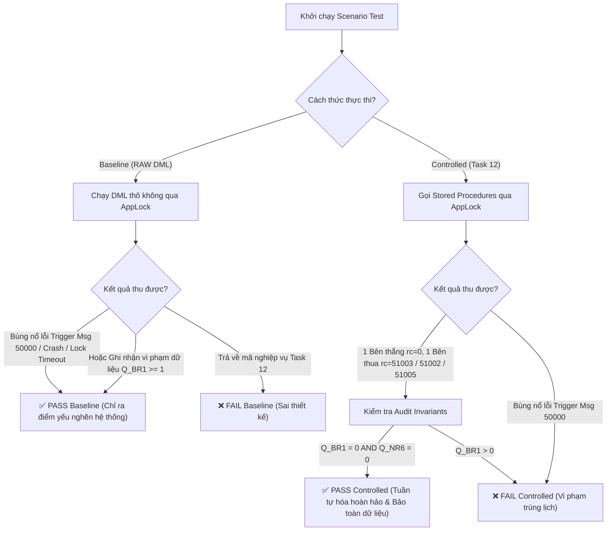

# Task 13 — Báo Báo Tổng Hợp Bộ Kiểm Thử Đồng Thời (Concurrency Test Suite Summary)

**Hệ thống:** CS486 — Hệ thống Quản lý Không gian Cơ sở Vật chất (Campus Space Management System)  
**Nhóm thực hiện:** G05  
**Môi trường thử nghiệm:** Microsoft SQL Server 2022 (Developer Edition) trên Docker Container (`cs486_sql_server`)  
**Cơ sở dữ liệu:** `CampusSpaceDB`  
**Thư mục lưu trữ:** `outputs/13-concurrency-tests-G05/`  

---

## 1. Muốn Test Cái Gì? (Test Objectives & Scope)

Mục tiêu cốt lõi của **Task 13** là xây dựng bộ kiểm thử đồng thời **Comparison Suite (So sánh đối ứng)** để đánh giá tính hiệu quả, tính đúng đắn và độ tin cậy của **4 Stored Procedure kiểm soát đồng thời ở Task 12** so với việc người dùng tự tương tác bằng các câu lệnh SQL thô (RAW DML).

### **Đối tượng So sánh:**
1. **Baseline (Chưa có Task 12 - RAW DML):** Giả lập người dùng/ứng dụng thực hiện trực tiếp các câu lệnh `INSERT INTO dbo.bookings`, `UPDATE dbo.maintenance`, `INSERT INTO dbo.booking_approvals` mà **không có cơ chế khóa ứng dụng (Application Lock)**.
2. **Controlled (Đã kiểm soát qua Task 12 Procedures):** Người dùng tương tác bắt buộc phải thông qua 4 Stored Procedure chuẩn hóa của Task 12:
   - `dbo.usp_booking_instant_submit` (Nộp đơn đặt phòng tức thì)
   - `dbo.usp_booking_approve` (Duyệt/từ chối đơn đặt phòng)
   - `dbo.usp_maintenance_report` (Tạo vé bảo trì không gian)
   - `dbo.usp_maintenance_set_impact_level` (Cập nhật mức độ ảnh hưởng/leo thang bảo trì)
   - *Cơ chế cốt lõi:* Cả 4 procedure cùng chia sẻ 1 cơ chế **Khóa Ứng Dụng Độc Quyền theo Không gian (`sys.sp_getapplock` trên tài nguyên `space_booking:<space_id>`)**.

---

### **9 Kịch bản Kiểm thử Đồng thời (Scenario Families):**

| Mã Kịch Bản | Tên Kịch Bản | Hành vi Mô phỏng Đồng thời (Concurrent Race) |
|:---:|:---|:---|
| **K1** | **Instant vs Instant Submit** (`b01` / `c01`) | 2 User cùng nộp đơn đặt phòng tức thì (Instant) trùng khung giờ trên cùng 1 phòng. |
| **K2** | **Instant Submit vs Staff Approval** (`b02` / `c02`) | User A nộp đơn instant đè lên khung giờ mà Staff B đang duyệt 1 đơn pending khác. |
| **K3 / K3'** | **Escalation vs In-flight Submit** (`b03` / `c03` / `c03b`) | Vé bảo trì được leo thang lên Out-of-Service (OOS) đua với đơn đặt phòng mới nộp. |
| **T5 / T7** | **AppLock Timeout & Retry** (`b05` / `c05`) | Thử nghiệm giới hạn thời gian chờ khóa (5s Timeout) và cơ chế tự động thử lại sau khi nhả khóa. |
| **K5** | **OOS Ticket Creation vs Submit** (`b09` / `c09`) | Nhân viên tạo mới vé bảo trì Out-of-Service đua với đơn đặt phòng instant mới. |
| **Staff Race** | **Staff vs Staff Same-Conflict** (`b10` / `c10`) | 2 Nhân viên quản lý cùng duyệt 2 đơn pending trùng khung giờ trên cùng 1 phòng. |
| **Soft Gate** | **Soft-gate Fallback** (`c11`) | Đặt phòng có mục đích không khớp loại phòng (`lecture` trên `meeting_room`) tự động chuyển sang `pending` (fallback). |
| **Fallback Race** | **Fallback vs Instant Overlap** (`c12`) | Đơn `pending` (fallback) không được chặn đơn `instant` mới, nhưng khi duyệt đơn `pending` sau đó phải bị từ chối do bị instant chiếm lịch. |
| **Ack Repair** | **Advisory Ack Repair** (`c13`) | Tự động ghi nhận/khôi phục dòng xác nhận cảnh báo bảo trì (`booking_advisory_acknowledgement`) khi Staff duyệt đơn. |

---

## 2. Test Như Thế Nào? (Testing Methodology)

### **a) Mô hình Khởi chạy 2 Session Song Song (Dual-Session Execution):**
- Sử dụng 2 tiến trình `sqlcmd` độc lập chạy trên 2 Terminal/Thread riêng biệt đại diện cho **Session A** và **Session B**.
- Tiến trình Runner (`run_all.sh`) khởi chạy `_a.sql` và `_b.sql` đồng thời trong cùng một milisecond bằng kỹ thuật chạy nền trong Bash (`sqlcmd -i _a.sql & sqlcmd -i _b.sql & wait`) để ép SQL Server phải xử lý đua tranh khóa (Lock Contention) thực sự.

### **b) Khởi tạo Fixture Độc lập & Cô lập tuyệt đối (`00_setup.sql` & `99_cleanup.sql`):**
- **Không gian thử nghiệm độc lập:** Bộ test tự định nghĩa dữ liệu riêng (`TEST-13-Dept`, 2 user `test13.requester` / `test13.staff`, 9 phòng `TEST-13-01-MR` đến `TEST-13-09-MR`).
- **Khung giờ thử nghiệm cô lập:** Tất cả các mốc thời gian đặt phòng đều nằm ở tương lai xa $\ge +600$ ngày so với thời điểm chạy test. Điều này đảm bảo tuyệt đối không va chạm hay làm hỏng dữ liệu mẫu của Task 06 hay Task 12.
- **Quy trình đóng gói Idempotent:** Trước và sau mỗi lượt chạy test, script `99_cleanup.sql` thực hiện dọn dẹp sạch sẽ toàn bộ dòng dữ liệu `TEST-13` theo thứ tự rào cản khóa ngoại (FK-safe).

---

## 3. Cơ Chế Đánh Giá Test Là Thế Nào? (Evaluation Criteria)

Bộ kiểm thử đánh giá tính ĐẠT/KHÔNG ĐẠT (PASS/FAIL) dựa trên các tiêu chí nghiêm ngặt sau:



### **1. Quy tắc Đánh giá Baseline (Chưa kiểm soát):**
- **ĐẠT (PASS Baseline):** Khi bài test thể hiện được điểm yếu của DML thô thông qua:
  - Bùng nổ lỗi SQL Server Engine / Trigger Phase 1 (`Msg 50000` từ `trg_bookings_prevent_overlap`, `Msg 3609` Abort batch).
  - Hoặc bộc lộ vi phạm toàn vẹn dữ liệu thực sự ($Q_{BR1} \ge 1$: 2 đơn trùng lịch cùng `approved`; hoặc $Q_{NR6} \ge 1$: đơn đặt trùng giờ phòng Out-of-Service).
- **KHÔNG ĐẠT:** Nếu Baseline trả về mã lỗi nghiệp vụ của Task 12.

### **2. Quy tắc Đánh giá Controlled (Task 12 Procedures):**
- **ĐẠT (PASS Controlled):** Bắt buộc thỏa mãn đồng thời 3 điều kiện:
  1. **Tuần tự hóa mượt mà (Serialized):** Đúng 1 Session đến trước chiến thắng (`rc = 0`), Session đến sau bị từ chối mượt mà với mã lỗi nghiệp vụ chuẩn định danh (`rc = 51003` BR1 Overlap; `rc = 51002` BR4 OOS Space; `rc = 51005` Lock Timeout).
  2. **Tuyệt đối không Crash hệ thống:** 0% lỗi `Msg 50000` từ Trigger Phase 1.
  3. **Bảo toàn dữ liệu (Invariant Audit):** Script `audit_invariant.sql` xác nhận $Q_{BR1} = 0$ (Không có cặp trùng lịch) và $Q_{NR6} = 0$ (Không có đặt phòng trùng giờ Out-of-Service).

---

## 4. Vấn Đề Gì Xuất Hiện Sau Khi Test? (Key Findings & Insights)

Sau khi thực thi toàn bộ 29 kịch bản kiểm thử trên SQL Server Docker Container, các phát hiện quan trọng được ghi nhận như sau:

### **1. Điểm yếu nghiêm trọng của Baseline (RAW DML):**
- **Ứng dụng bị Crash do Lỗi Trigger `Msg 50000`:** Trong các kịch bản đua lệnh instant submit (`b01`), do DML thô không có khóa ứng dụng trước, câu lệnh `INSERT` kích hoạt Trigger Phase 1 (`trg_bookings_prevent_overlap`). Khi Session B bị treo khóa (blocking) chờ A commit xong, Trigger của B thức dậy phát hiện trùng lịch và quăng lỗi `Msg 50000` kèm `ROLLBACK TRANSACTION`. Điều này làm **crash/abort giao dịch tầng ứng dụng của Client**.
- **Nguy cơ vi phạm trùng lịch ($Q_{BR1} \ge 1$):** Trong kịch bản phối hợp Duyệt phòng vs Instant Submit (`b02`), nếu không có AppLock kiểm soát việc đọc/ghi bảng `booking_approvals`, cả 2 giao dịch có thể cùng commit thành công 2 đơn đặt phòng trùng lịch trên cùng 1 phòng, làm hỏng toàn vẹn dữ liệu.

### **2. Sự vượt trội của Controlled (Task 12 Stored Procedures):**
- **Giải quyết triệt để nghẽn khóa và crash hệ thống:** Khóa ứng dụng `sys.sp_getapplock` (`space_booking:<space_id>`, Exclusive, 5s timeout) bắt các giao dịch cùng tác động vào 1 phòng phải xếp hàng tuần tự hóa ở tầng logic trước khi đụng vào bảng dữ liệu.
- **Trải nghiệm người dùng chuyên nghiệp:** Session bị trùng lịch nhận ngay phản hồi định danh chi tiết (`rc = 51003` / `51002`) mà không làm nổ lỗi SQL Server, giúp Frontend/API xử lý thông báo mượt mà.
- **Bảo toàn dữ liệu tuyệt đối:** Đạt $Q_{BR1} = 0$ và $Q_{NR6} = 0$ trên 100% các kịch bản controlled.

---

## 5. Hướng Dẫn Tái Hiện Kết Quả Kiểm Thử (How to Reproduce Results)

Để tái hiện lại 100% kết quả kiểm thử trên máy tính của bạn, thực hiện theo các hướng dẫn sau:

### **a) Tái hiện toàn bộ 29 Test Case tự động (1 Lệnh duy nhất):**
Chạy script orchestrator `run_all.sh` thông qua Docker:

```bash
docker exec -w /tmp/t13 -e PATH="/opt/mssql-tools18/bin:/usr/local/sbin:/usr/local/bin:/usr/sbin:/usr/bin:/sbin:/bin" -e SQLCMD_SERVER=localhost -e SQLCMD_DB=CampusSpaceDB -e SQLCMD_USER=sa -e SQLCMD_PASSWORD='StrongPassword123!' cs486_sql_server bash /tmp/t13/run_all.sh
```

---

### **b) Tái hiện từng Kịch bản Demo Nổi bật (Copy & Paste vào Terminal):**

#### **1. Demo Controlled `c01` (Instant vs Instant Submit — 2 Đơn instant nộp đua nhau):**
```bash
docker exec -w /tmp/t13 cs486_sql_server /opt/mssql-tools18/bin/sqlcmd -b -C -I -S localhost -U sa -P 'StrongPassword123!' -d CampusSpaceDB -i 99_cleanup.sql && docker exec -w /tmp/t13 cs486_sql_server /opt/mssql-tools18/bin/sqlcmd -b -C -I -S localhost -U sa -P 'StrongPassword123!' -d CampusSpaceDB -i 00_setup.sql && (docker exec -w /tmp/t13 cs486_sql_server /opt/mssql-tools18/bin/sqlcmd -C -I -S localhost -U sa -P 'StrongPassword123!' -d CampusSpaceDB -i controlled/c01_instant_a.sql & docker exec -w /tmp/t13 cs486_sql_server /opt/mssql-tools18/bin/sqlcmd -C -I -S localhost -U sa -P 'StrongPassword123!' -d CampusSpaceDB -i controlled/c01_instant_b.sql & wait)
```
*Kết quả:* 1 đơn thành công `rc=0`, 1 đơn trả về mã lỗi nghiệp vụ `51003`.

#### **2. Demo Controlled `c02` (Instant Submit vs Staff Approval — Nộp instant đua với Duyệt phòng):**
```bash
docker exec -w /tmp/t13 cs486_sql_server /opt/mssql-tools18/bin/sqlcmd -b -C -I -S localhost -U sa -P 'StrongPassword123!' -d CampusSpaceDB -i 99_cleanup.sql && docker exec -w /tmp/t13 cs486_sql_server /opt/mssql-tools18/bin/sqlcmd -b -C -I -S localhost -U sa -P 'StrongPassword123!' -d CampusSpaceDB -i 00_setup.sql && (docker exec -w /tmp/t13 cs486_sql_server /opt/mssql-tools18/bin/sqlcmd -C -I -S localhost -U sa -P 'StrongPassword123!' -d CampusSpaceDB -i controlled/c02_instant_staff_a.sql & docker exec -w /tmp/t13 cs486_sql_server /opt/mssql-tools18/bin/sqlcmd -C -I -S localhost -U sa -P 'StrongPassword123!' -d CampusSpaceDB -i controlled/c02_instant_staff_b.sql & wait)
```

#### **3. Demo Controlled `c03` (Escalation vs In-flight Submit — Leo thang bảo trì Out-of-Service):**
```bash
docker exec -w /tmp/t13 cs486_sql_server /opt/mssql-tools18/bin/sqlcmd -b -C -I -S localhost -U sa -P 'StrongPassword123!' -d CampusSpaceDB -i 99_cleanup.sql && docker exec -w /tmp/t13 cs486_sql_server /opt/mssql-tools18/bin/sqlcmd -b -C -I -S localhost -U sa -P 'StrongPassword123!' -d CampusSpaceDB -i 00_setup.sql && (docker exec -w /tmp/t13 cs486_sql_server /opt/mssql-tools18/bin/sqlcmd -C -I -S localhost -U sa -P 'StrongPassword123!' -d CampusSpaceDB -i controlled/c03_escalation_a.sql & docker exec -w /tmp/t13 cs486_sql_server /opt/mssql-tools18/bin/sqlcmd -C -I -S localhost -U sa -P 'StrongPassword123!' -d CampusSpaceDB -i controlled/c03_escalation_b.sql & wait)
```
*Kết quả:* Đơn nộp trùng khung giờ Out-of-Service bị chặn mượt mà với mã `51002`.

#### **4. Demo Controlled `c05` (AppLock Timeout & Retry — Thử nghiệm hết 5s Timeout và Thử lại):**
```bash
docker exec -w /tmp/t13 cs486_sql_server /opt/mssql-tools18/bin/sqlcmd -b -C -I -S localhost -U sa -P 'StrongPassword123!' -d CampusSpaceDB -i 99_cleanup.sql && docker exec -w /tmp/t13 cs486_sql_server /opt/mssql-tools18/bin/sqlcmd -b -C -I -S localhost -U sa -P 'StrongPassword123!' -d CampusSpaceDB -i 00_setup.sql && (docker exec -w /tmp/t13 cs486_sql_server /opt/mssql-tools18/bin/sqlcmd -C -I -S localhost -U sa -P 'StrongPassword123!' -d CampusSpaceDB -i controlled/c05_timeout_a.sql & docker exec -w /tmp/t13 cs486_sql_server /opt/mssql-tools18/bin/sqlcmd -C -I -S localhost -U sa -P 'StrongPassword123!' -d CampusSpaceDB -i controlled/c05_timeout_b.sql & wait)
```
*Kết quả:* Thao tác 1 bị hết timeout 5s nhận mã `51005` (retryable), thao tác retry 2 thành công `rc=0`.

---

### **c) Kiểm tra Invariant Audit Bảo toàn Dữ liệu:**
```bash
docker exec -w /tmp/t13 cs486_sql_server /opt/mssql-tools18/bin/sqlcmd -C -I -S localhost -U sa -P 'StrongPassword123!' -d CampusSpaceDB -i audit_invariant.sql
```
*Kết quả:* `PASS suite-audit: zero overlapping confirmed pairs AND zero confirmed-vs-OOS overlaps on TEST-13 spaces.`

---

### **d) Trích xuất File Log Tổng hợp Duy nhất (`SUMMARY.log`):**
Sau khi thực thi script, bạn có thể copy duy nhất 1 file tổng hợp log kết quả duy nhất từ Docker về máy host:
```bash
docker cp cs486_sql_server:/tmp/t13/results/SUMMARY.log outputs/13-concurrency-tests-G05/results/SUMMARY.log
```
File **[SUMMARY.log](file:///Users/caoquanghung/HCMUS/CS/DataBase/FinalProject/CS486-Project/outputs/13-concurrency-tests-G05/results/SUMMARY.log)** chứa đầy đủ chi tiết đầu ra của tất cả 29 kịch bản test mà không bị trùng lặp.
