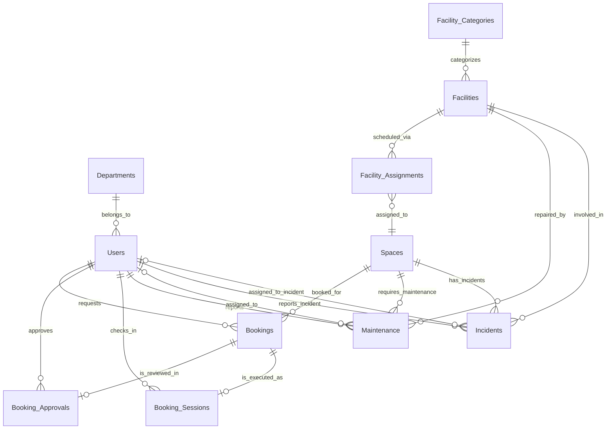
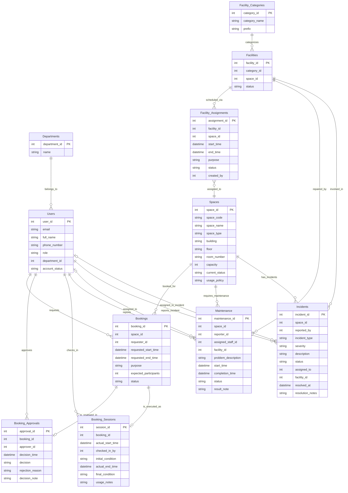

# Conceptual Entity-Relationship Diagram (ERD) — Campus Space Management System

**Group:** G05
**Course:** CS486 — Introduction to Database System
**Date:** 2026-06-18

---

## 1. Description and Core Entities

The Campus Space Management System database centers on **Users**, **Spaces**, and **Bookings**, supported by organizational units (**Departments**), equipment **categories (Facility_Categories)**, and individual device instances (**Facilities**). The booking lifecycle is split across three dedicated tables: **Bookings** handles the initial request, **Booking_Approvals** captures the approval/rejection decision, and **Booking_Sessions** tracks check-in and completion. Maintenance requests and assignments are managed through the **Maintenance** entity, with device assignments tracked through **Facility_Assignments** (time-range based assignments enabling location history and future reservation planning). `facilities.space_id` is retained as a cached column synced by the application layer. **Incidents** tracks unexpected events (theft, vandalism, accidents, safety hazards) tied to specific spaces, with trigger-based auto-resolution when related maintenance completes.

---

## 2. Mermaid.js ERD

### Diagram 1 — Overview (nodes only)

### Diagram 2 — Full Detail

---

## 3. Relationship Participation Summary

| # | Relationship | Cardinality | Mermaid Notation | Participation Explanation |
|---|---|---|---|---|
| R1 | Departments → Users | 1:N | `Departments \|\|--o{ Users` | Every User must belong to exactly 1 Department (total on Users — `department_id` NOT NULL); a Department may have zero or many Users. |
| R2 | Users → Bookings (requester) | 1:N | `Users \|\|--o{ Bookings` | Every Booking must have exactly 1 requester (total on Bookings — `requester_id` NOT NULL); a User may have zero or many Bookings. |
| R3 | Users → Booking_Approvals (approver) | 1:N | `Users \|\|--o{ Booking_Approvals` | Every Booking_Approval must have exactly 1 approver (total on Booking_Approvals — `approver_id` NOT NULL); a User may act as approver on zero or many decisions. |
| R4 | Users → Booking_Sessions (checks_in) | 1:N | `Users \|\|--o{ Booking_Sessions` | Every Booking_Session must have exactly 1 staff who performed check-in (total on Booking_Sessions — `checked_in_by` NOT NULL); a User may check in zero or many sessions. |
| R5 | Spaces → Bookings | 1:N | `Spaces \|\|--o{ Bookings` | Every Booking must reference exactly 1 Space (total on Bookings — `space_id` NOT NULL); a Space may have zero or many Bookings. |
| R6 | Spaces ↔ Facilities (via Facility_Assignments) | M:N (bridge) | *(resolved by R18 + R19)* | Facilities ↔ Spaces resolved through **Facility_Assignments** junction with time-range tracking. `facilities.space_id` is a cached column synced by the application layer, NOT the source of truth. |
| R7 | Spaces → Maintenance | 1:N | `Spaces \|\|--o{ Maintenance` | Every Maintenance record must reference exactly 1 Space (total on Maintenance — `space_id` NOT NULL); a Space may have zero or many Maintenance records. |
| R8 | Users → Maintenance (reporter) | 1:N | `Users \|\|--o{ Maintenance` | Every Maintenance record must have exactly 1 reporter (total on Maintenance — `reporter_id` NOT NULL); a User may report zero or many issues. |
| R9 | Users → Maintenance (assigned staff) | 1:N (partial) | `Users \|o--o{ Maintenance` | A Maintenance record may have zero or one assigned staff member (partial — `assigned_staff_id` is nullable); a User may be assigned to zero or many Maintenance records. |
| R10 | Bookings → Booking_Approvals | 1:0..1 | `Bookings \|\|--o\| Booking_Approvals` | A Booking may have zero or one approval decision (partial on Booking side — not all bookings reach a decision); every Booking_Approval must belong to exactly 1 Booking (total). |
| R11 | Bookings → Booking_Sessions | 1:0..1 | `Bookings \|\|--o\| Booking_Sessions` | A Booking may have zero or one check-in session (partial on Booking side — only checked-in bookings have a session); every Booking_Session must belong to exactly 1 Booking (total). |
| R12 | Spaces → Incidents | 1:N | `Spaces \|\|--o{ Incidents` | Every Incident must belong to exactly 1 Space (total on Incidents — `space_id` NOT NULL); a Space may have zero or many Incidents. |
| R13 | Users → Incidents (reporter) | 1:N | `Users \|\|--o{ Incidents` | Every Incident must have exactly 1 reporter (total on Incidents — `reported_by` NOT NULL); a User may report zero or many Incidents. |
| R14 | Users → Incidents (assigned_to) | 1:N (partial) | `Users \|o--o{ Incidents` | An Incident may have zero or one assigned staff member (partial — `assigned_to` is nullable); a User may be assigned to zero or many Incidents. |
| R15 | Facility_Categories → Facilities | 1:N | `Facility_Categories \|\|--o{ Facilities` | Every Facility must belong to exactly 1 Facility_Category (total on Facilities — `category_id` NOT NULL); a Facility_Category may have zero or many Facilities. |
| R16 | Facilities → Maintenance | 1:N (partial) | `Facilities \|o--o{ Maintenance` | A Maintenance record may reference zero or one Facility (partial — `facility_id` is nullable); a Facility may be involved in zero or many Maintenance records. |
| R17 | Facilities → Incidents | 1:N (partial) | `Facilities \|o--o{ Incidents` | An Incident may reference zero or one Facility (partial — `facility_id` is nullable); a Facility may be involved in zero or many Incidents. |
| R18 | Facilities → Facility_Assignments | 1:N | `Facilities \|\|--o{ Facility_Assignments` | Every Facility_Assignment must reference exactly 1 Facility (total — `facility_id` NOT NULL); a Facility may have zero or many assignments over time. |
| R19 | Facility_Assignments → Spaces | N:1 | `Facility_Assignments }o--\|\| Spaces` | Every Facility_Assignment must target exactly 1 Space (total — `space_id` NOT NULL); a Space may be the target of zero or many assignments. |

---

## 4. Logical Constraints

These constraints are enforced at the application or trigger level and are not expressible in Mermaid ERD syntax:

1. **Approver role constraint** — `Booking_Approvals.approver_id` must reference a User with `role IN ('facility_staff', 'facility_manager')`. Students, lecturers, TAs, and department admins may not approve or reject bookings.

2. **Check-in staff role constraint** — `Booking_Sessions.checked_in_by` must reference a User with `role IN ('facility_staff', 'facility_manager')`. Only authorized facility personnel may perform check-in.

3. **Assigned maintenance staff constraint** — `Maintenance.assigned_staff_id` must reference a User with `role = 'facility_staff'`. Only facility staff may be assigned to resolve maintenance issues.

4. **Booking non-overlap constraint** — No two Bookings for the same Space may have overlapping time ranges when both are in status `approved`, `checked_in`, or `completed`. Overlap condition: `requested_start_time < existing_end_time AND requested_end_time > existing_start_time`.

5. **Space availability constraint** — A Space with `current_status IN ('under_maintenance', 'temporarily_closed', 'retired')` may not receive new approved Bookings.

6. **Soft deletion** — Bookings and Maintenance records use `is_deleted = 1` for logical deletion, preserving historical records for audit and reporting.
7. **Incident availability constraint** — A Space with unresolved Incidents (`status IN ('reported','investigating')`) may not receive new approved Bookings. Incident records may optionally reference a specific Facility device (`facility_id`) for device-level incidents.
8. **Incident auto-resolution** — When Maintenance transitions to `'resolved'`, unresolved Incidents are automatically resolved. If Maintenance references a specific Facility (`facility_id`), only Incidents for the same Facility AND same Space with `created_at < maintenance.completion_time` are resolved. If `facility_id` is NULL, all unresolved Incidents in the same Space are resolved (fallback).
9. **Facility assignment overlap constraint** — Each Facility may have multiple assignments at different times, but assignments with `status IN ('planned','active')` must not have overlapping time ranges. Overlap condition: `start_time < existing_end_time AND end_time > existing_start_time`. At most one `'active'` assignment per Facility at any moment.

---

## Pre-Submission Validation Checklist

- [x] All 11 entities from entity-registry are present (Departments, Users, Spaces, Facility_Categories, Facilities, **Facility_Assignments**, Bookings, Booking_Approvals, Booking_Sessions, Maintenance, Incidents)
- [x] All business attributes from entity-registry are present for each entity (audit columns and soft-delete flags omitted — physical-layer concern per Rule E)
- [x] All 19 relationships from the Relationship Registry are present (R1–R19)
- [x] Cardinality is correct: 1:N for R1–R5, R7–R8, R12–R13, R15, R18; 1:0..1 for R10–R11; 1:N partial for R9, R14, R16–R17; N:1 for R19; M:N bridge for R6
- [x] Participation constraints (`||` mandatory, `|o` optional) are explicitly stated and justified per Section 3
- [x] R6 is resolved through Facility_Assignments (junction with time-range); `facilities.space_id` is a cached column synced by app layer
- [x] Foreign keys are represented by relationship lines — not marked in entity attribute blocks (only `PK` markers)
- [x] Primary keys are marked with `PK`
- [x] No duplicate entity definitions
- [x] Role-based constraints documented in Section 4 (Logical Constraints)
- [x] Entity count matches entity-registry (11 entities)
- [x] Key design decisions documented in `docs/design-decisions.md` (run_01 amendment — facility refactoring, run_02 amendment — remove space_facilities, run_03 amendment — facility_assignments, building/floor, rejection reason, SRP split)

---

*Generated for CS486 Group G05 — Campus Space Management System*
